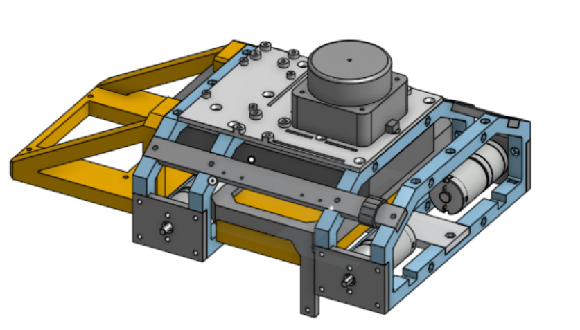
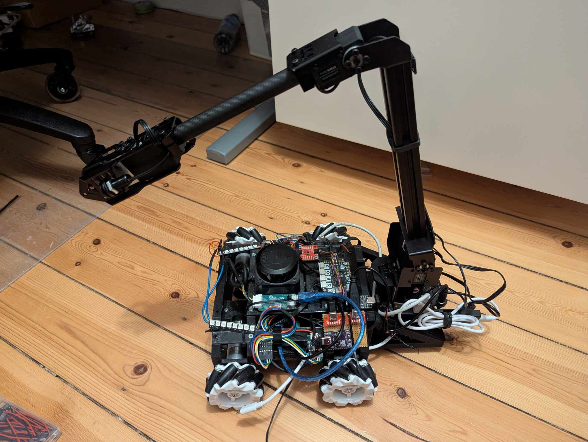
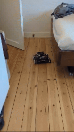
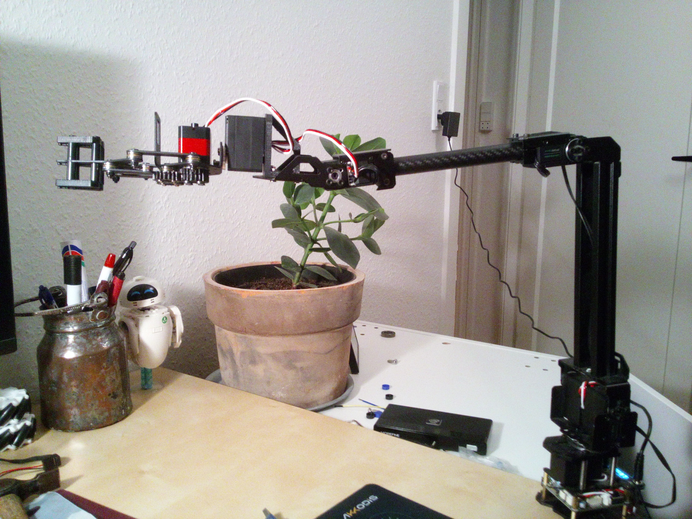

# Simplebot 3

[simplebot2](https://github.com/alemantus/simplebot2) had become a clutter of learning mistakes, for example instead of using ros2 control I wrote my own setup using topics instead of joint states, which worked but made everything miserable. Using nav2 for example where held together using the software equivalent of ducktape, and using gazebo were downright impossible. Hence simplebot3 is the project where i focus on doing things the right (or righter) way. Starting with implementing ros2_control and simplebot_description so that I can implement new features in gazebo first, get everything to work with all the comforts of simulated environments, and then transfer that to the real robot. I will consider simplebot2 an astounding success in that it taught me so much about ros2 and that doing things wrong at least helps you to understand that the correct way is better for a reason.  

## So what works?

Currently I have the following up and running
- Sensors
  - Orbbecc femto bolt tof camera with integrated IMU
  - 4x motorencoders
  - Slamtech c1 LiDAR
  - External IMU (LSM6DS)
 
- Nav2
  - SLAM
  - Sensor fusion and pose estimation
  - Mapping and localization

- Gazebo environment
  - Mecanum drive plug-in
  - Orbbec femto bolt camera
  - Moveit for the robot arm (Roarm m2 + hand form waveshare)

- URDF descriptions
  - Of Helene (the robot)
  - Orbbec femto bolt camera
  - Of the roarm2
  - The robot arm extended with gripper
    
- MoveIt2 for arm with 5 DoF and gripper

## Showcase Files

### 1. CAD Drawing
Image of the CAD drawing made in onshape. You can see the project [here](https://cad.onshape.com/documents/58d69eaf54d5097cb2ee2932/w/94ca09f7b1264f3339bd84c4/e/7cb0b81673ac10f236b6e9ed?renderMode=0&uiState=67c86245d6e5c919753ec178)

### 2. Robot with Arm
A image of the robot with an articulated arm. The arm in question is the waveshare RoArm-M2-S.

### 3. Autonomous Driving Demo
A demonstration video showcasing the autonomous driving functionality in action.

### 4. Roarm m2 controlled using moveit2

New roarm fitted with gripper and two extra DoF

